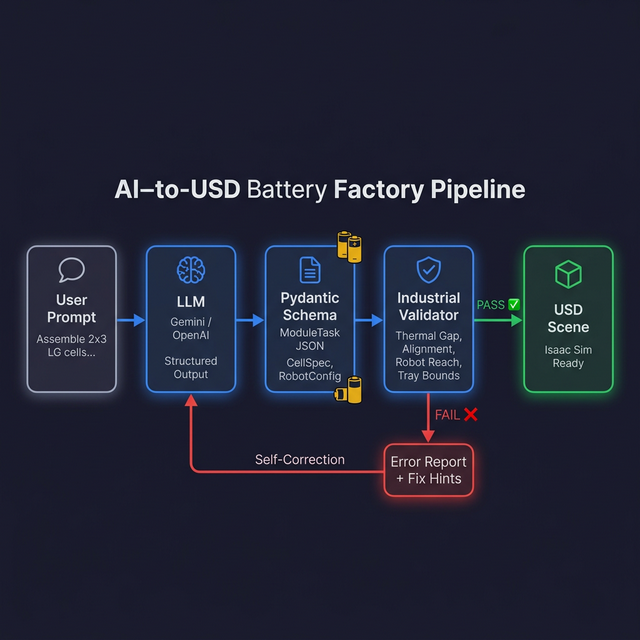
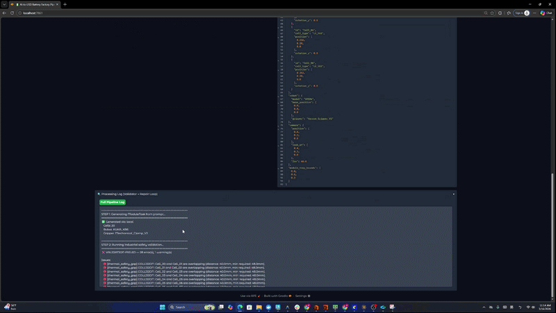

# 🔋 AI-to-USD Battery Factory Pipeline

An AI agent that automatically generates validated USD industrial scenes  
for EV battery module assembly in NVIDIA Isaac Sim.



**What it does:**
- **Prompt → Structured JSON spec** for battery module assembly  
- **Industrial safety validation** with real manufacturing constraints  
- **LLM self-correction loop** — the AI fixes its own errors  
- **Top-down layout preview** with robot reach envelope visualization  



---

## Why This Matters

In battery pack manufacturing, scene setup for Isaac Sim is manual and error-prone.  
Engineers describe assembly tasks ambiguously, then spend hours placing cells,  
configuring robot arms, and debugging collision issues.

This project explores an **AI-driven orchestration loop**:

```
prompt → Pydantic schema → industrial validator → self-correction → USD-ready spec
```

The interesting part is **not** just generation — it's the validation and repair.  
Pure LLM generation fails silently when spatial constraints matter.  
This system catches those failures with domain-specific physics rules,  
then feeds structured error reports back to the LLM for self-correction.

---

## Architecture

```
User prompt (natural language)
    ↓
LLM (Gemini / OpenAI — structured output)
    ↓
ModuleTask JSON (Pydantic schema)
    ↓
Industrial Validator (5 rules)
    ├── ✅ PASS → Preview + USD-ready spec
    └── ❌ FAIL → Error Report → LLM Self-Correction → re-validate (max 3×)
```

### Validation Rules

| Rule | What it checks | Why it matters |
|:---|:---|:---|
| **Thermal Safety Gap** | Cell spacing based on chemistry (LG/HY/CATL) | Thermal runaway cascade prevention |
| **Cell Alignment** | Rotation must be 0° or 180° | Busbar welding jig compatibility |
| **Robot Reachability** | Cell within arm work envelope | UR10e/KUKA/FANUC reach + dead zone |
| **Module Tray Bounds** | Cells inside physical tray | Assembly line collision avoidance |
| **Cell Count** | Station throughput limits | Cycle-time and thermal management |

### Cell Catalogue (Real Specs)

| Cell | Dimensions | Weight | Min Gap |
|:---|:---|:---|:---|
| LG E63 | 50 × 120 × 200mm | 0.82 kg | 2mm |
| HY 50Ah | 45 × 148 × 95mm | 1.06 kg | 3mm |
| CATL LFP | 54 × 174 × 207mm | 1.24 kg | 2mm |

### Robot Profiles

| Robot | Max Reach | Dead Zone | Payload |
|:---|:---|:---|:---|
| UR10e | 1.30m | 0.18m | 12.5 kg |
| KUKA KR6 | 0.90m | 0.15m | 6.0 kg |
| FANUC CRX10 | 1.25m | 0.20m | 10.0 kg |

---

## Quick Start

```bash
pip install -r requirements.txt

# Set your API key (at least one)
export GEMINI_API_KEY="your-key-here"
# or
export OPENAI_API_KEY="your-key-here"

# Run the app
python app.py
```

Then open `http://localhost:7861` in your browser.

> **No API key?** Falls back to local inference mode with pre-computed module specs.

---

## Example Scenarios

### ✅ Valid: 2×3 LG Module
```
Assemble a 2x3 grid of LG E63 battery cells with a UR10e robot arm.
```
→ 6 cells, all rules pass, clean layout preview with reach envelope.

### ❌ Failure: Overcrowded Module
```
Pack 20 HY 50Ah cells tightly in a small 0.5m tray with KUKA KR6.
```
→ Cell count WARNING, thermal gap ERRORs, tray bounds ERRORs.

### 🔧 Self-Correction: Out of Reach + Bad Rotation
```
6 CATL LFP cells. Cell_05 at [2.5, 1.0, 0.0]. Cell_03 rotated 45°.
```
→ Robot reach ERROR + alignment ERROR → LLM self-corrects → re-validates.

See [`examples/`](examples/) and [`sample_outputs/`](sample_outputs/) for full inputs/outputs.

---

## Tech Stack

- **LLM**: Gemini 2.0 Flash (structured output) / OpenAI GPT-4o-mini (fallback)
- **Schema**: Pydantic v2 with industrial-constrained enums
- **Validation**: Custom rule engine with physics-based domain rules
- **Preview**: matplotlib (2D top-down with reach envelope)
- **UI**: Gradio

---

## Builder Focus: Why Pure LLM Generation Fails for Spatial Tasks

LLMs generate plausible-looking coordinates but have no spatial reasoning.  
In testing, GPT-4o and Gemini Flash both produce:
- Cells overlapping by 5-10mm (invisible in text, catastrophic in sim)
- Coordinates outside robot reach (motion planning fails silently)
- Arbitrary rotation angles (busbar welding jig won't clamp)

The fix is **not** a longer prompt. It's a **validation loop** that:
1. Catches specific physical violations
2. Generates structured error reports with actionable fix hints
3. Feeds those hints back to the LLM for targeted self-correction

This pattern — *structured output + domain validator + repair loop* —  
is generalizable beyond battery assembly to any spatial LLM application.

---

## Limitations

- **No actual USD export yet** — generates the validated spec, not the `.usd` file  
- **2D preview only** — no 3D rendering (would require Isaac Sim installed)  
- **Cell catalogue is small** — 3 cell types from specs I could find publicly  
- **Robot reach is simplified** — uses spherical envelope, not actual joint kinematics  
- **Max 3 repair attempts** — may accept imperfect output  
- **No real thermal simulation** — gap rules are distance-based heuristics  

These are deliberate scope boundaries. The point is to demonstrate the  
**validation and repair loop pattern**, not to replace a production CAD system.

---

## Project Structure

```
spec-to-sim-copilot/
├── app.py            — Gradio UI (port 7861)
├── schema.py         — Pydantic models (ModuleTask, CellSpec, RobotConfig)
├── llm.py            — LLM integration (generate + repair)
├── validator.py      — 5 industrial validation rules
├── preview.py        — matplotlib assembly layout renderer
├── config.py         — Robot profiles, cell catalogue, constants
├── examples/         — Input prompts for 3 scenarios
├── sample_outputs/   — Expected JSON outputs
├── assets/           — Architecture diagram
├── requirements.txt
└── .gitignore
```

---

## License

MIT
